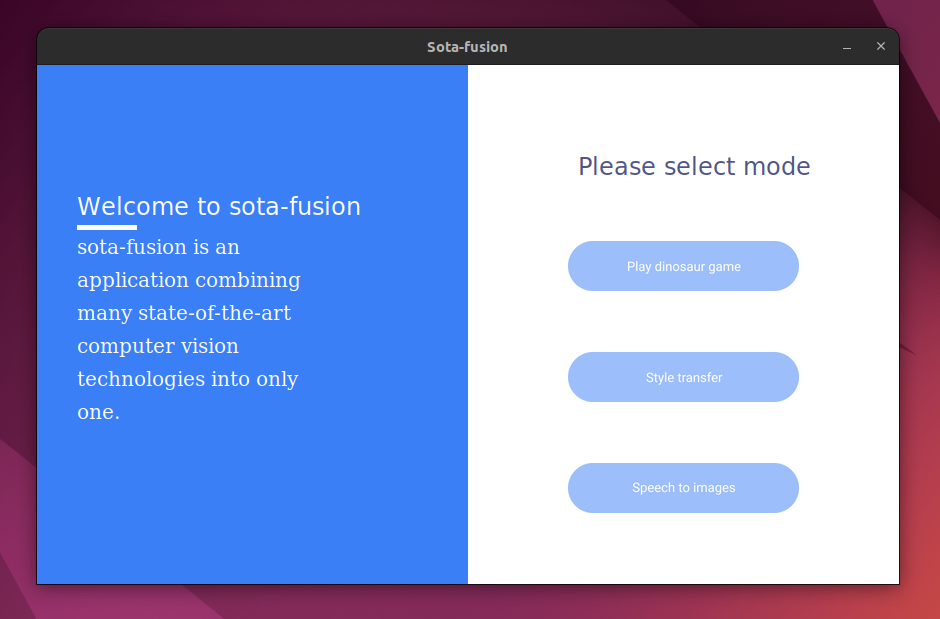

# sota-fusion
Application to reach the state of art in Deep learning



## How to use?
This application includes 3 modes : 
1. Dinosaur game with gesture detection to control the game
2. Style transfer 
3. Speech to image using Stable Diffusion and Vietnamese speech recognition

To launch this application :
```bash
python3 ui/client.py
```

